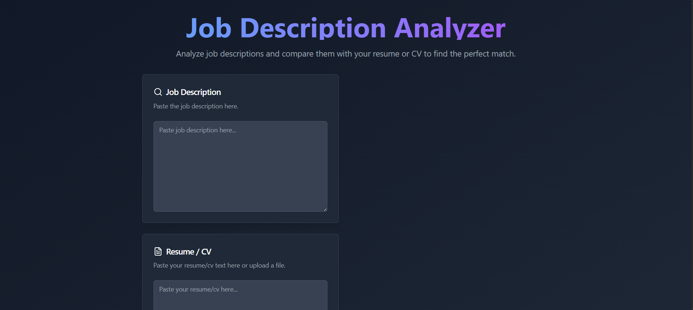

<h1>Job Description Analyzer</h1>

           

       

    The Job Description Analyzer is a Python Flask application designed to analyze job descriptions and compare them against candidate resumes or CVs. It extracts skills, categorizes them, and calculates a match percentage, highlighting matched and missing keywords. The frontend is built with React, TypeScript, and Tailwind CSS for a modern, responsive user interface.

<h2>Features</h2>
        <ul>
            <li><strong>Skill Extraction:</strong> Extracts skills from job descriptions and resumes/CVs.</li>
            <li><strong>Skill Categorization:</strong> Categorizes extracted skills (e.g., programming, technical, soft, management).</li>
            <li><strong>Match Analysis:</strong> Calculates a match percentage.</li>
             <li><strong>Keyword Matching:</strong> Identifies matched and missing keywords.</li>
            <li><strong>Scoring and Match Level:</strong> Provides a match level (e.g., Poor, Fair, Good, Perfect).</li>
            <li><strong>Web API:</strong> Flask-based API.</li>
            <li><strong>Frontend:</strong> React-TypeScript User interface for interacting with the analyzer.</li>
        </ul>

<h2>Tech Stack</h2>
<ul>
    <li><strong>Frontend:</strong> React
            <ol>
                <li><strong>UI Library/Framework:</strong> React Bootstrap, Tailwind CSS</li>
                <li><strong>State Management:</strong> Redux</li>
                <li><strong>Other:</strong> framer-motion, lucide-react,  React Icons</li>
                <li><strong>Deployment:</strong> Vercel</li>
            </ol>
    </li>

  <li><strong>Backend:</strong> Python
            <ol>
                <li><strong>Framework:</strong> Flask</li>
                <li><strong>NLP:</strong> NLTK</li>
                <li><strong>Other:</strong> re, logging</li>
                <li><strong>Deployment:</strong> Render</li> -->
            </ol>
   </li>
</ul>

<h2>Project Structure</h2> 
    

    The project has a combined frontend and backend structure. <code>app.py</code>. Key functions:
    

    <ul>
    <li>Frontend:
            <ul>
                <li>React components and related files.</li>
                <li>Uses React Bootstrap and Tailwind CSS for styling.</li>
                <li>Uses React Scripts and Vite.</li>
            </ul>
    </li>
    </ul>
    
Backend: (Key functions) in <code>app.py</code>:

    <ul>
        <li><code>app.py</code>: Contains the Flask backend application.</li>
        <li><code>preprocess_text(text)</code>: Cleans and tokenizes text.</li>
        <li><code>extract_skills(text)</code>: Extracts and categorizes skills.</li>
        <li><code>get_match_level(percentage)</code>: Assigns a match level.</li>
        <li><code>match_skills(job_skills, candidate_skills, weights)</code>: Calculates match scores.</li>
        <li><code>analyze_match(job_description, resume_text, cv_text, weights)</code>: Orchestrates analysis.</li>
        <li><code>analyze()</code>: Flask route for analysis requests.</li>
    </ul>

<h2>Deployment</h2>
    

        The application is designed to be deployed with the frontend and backend handled separately.  The current recommendation is:
    

     <ul>
        <li>Backend:  Deploy the Flask application to Render.</li>
        <li>Frontend:  Deploy the React application to Vercel.</li>
    </ul>

<h3>Render Deployment Steps (Backend)</h3>
    <ol>
        <li><strong>Prepare Your Flask App:</strong> 
            Ensure your Flask code is in a Git repository.  Create <code>requirements.txt</code>: 
            <code>pip freeze > requirements.txt</code> 
            Create a <code>Procfile</code>: 
            <code>web: gunicorn app:app</code>
        </li>
        <li><strong>Create a Render account:</strong> Sign up at <a href="https://render.com/">render.com</a>.</li>
        <li><strong>Connect your Git repository:</strong> Connect your project's Git repository to Render.</li>
        <li><strong>Create a Web Service:</strong> On Render, create a new "Web Service" and select your repository.</li>
        <li><strong>Configure:</strong> 
            Environment: Choose a Python version. 
            Build Command: <code>pip install -r requirements.txt</code> 
            Start Command: <code>gunicorn app:app</code> 
            Region: Select a region.
        </li>
        <li><strong>Deploy:</strong> Render will build and deploy your Flask application.</li>
    </ol>

<h3>Vercel Deployment Steps (Frontend)</h3>
    <ol>
        <li><strong>Prepare Your React App:</strong> 
            Ensure your React application code is in a Git repository.
        </li>
         <li><strong>Create a Vercel account:</strong> Sign up at <a href="https://vercel.com/">vercel.com</a>.</li>
        <li><strong>Connect your Git repository:</strong> Connect your project's Git repository to Vercel.</li>
        <li><strong>Create a new project:</strong> On Vercel, create a new project and select your repository.</li>
        <li><strong>Configure:</strong> 
             Vercel will usually automatically detect that it is a React application. 
             Set the environment variable for the backend URL (e.g., <code>REACT_APP_BACKEND_URL</code>) to the URL of your Flask application on Render.
        </li>
        <li><strong>Deploy:</strong> Vercel will build and deploy your React application.</li>
    </ol>

<h2>Improvements</h2>
    <ul>
        <li>Fine-tune skill extraction with more sophisticated NLP.</li>
        <li>Enhance to support more file formats.</li>
    </ul>